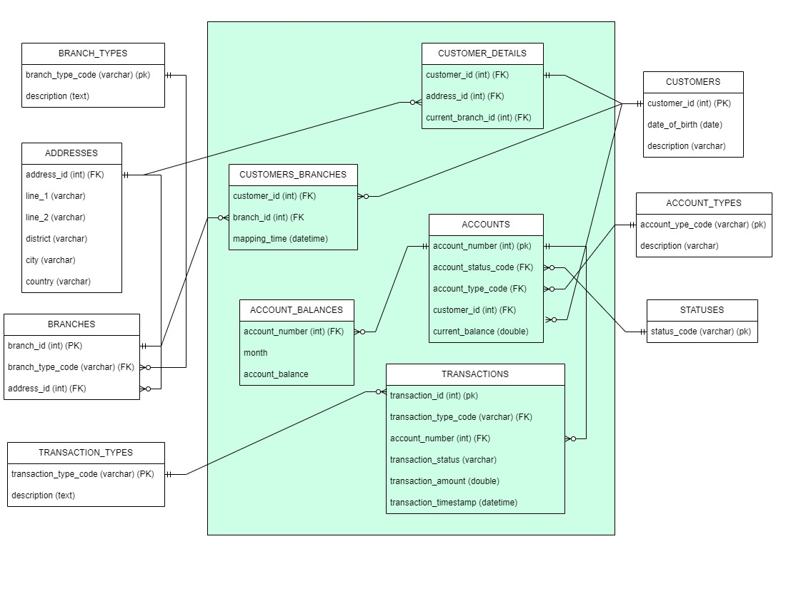

## The image below shows the database model design

## Fact and dimenstion table
We have some tables in roles *Fact* and some tables in responsibility as *Dimension*

The *Fact* tables are grouped in center with background color filled, consist of:
- CUSTOMER_DETAILS
- CUSTOMER_BRANCHES
- TRANSACTIONS
- ACCOUNTS
- ACCOUNT_BALANCES

The *Dimension* tables including:
- BRANCH_TYPES
- BRANCHES
- ADDRESSES
- CUSTOMERS
- ACCOUNT_TYPES
- STATUSES
- TRANSACTION_TYPES

## Data flow:
We have some extra tables: CUSTOMER_DETAILS, CUSTOMER_BRANCHES, ACCOUNT_BALANCES to reach the requirements about analysis purpose
- CUSTOMER_DETAILS is divided by CUSTOMER and has 1:1 relationship with CUSTOMER. This will give an explicit division about *Fact* tables and *Dimension* tables. The CUSTOMER table is a *Dimension* table with the characteristics of a customer, not reflecting their relationship with other tables. The CUSTOMER_DETAILS is *Fact* table when they focus to store the foreign key.

- CUSTOMER_BRANCHES is used to check customer branch over time. It stores the historical data about the branch where customer belongs to. We have *customer_id* to identify customer, *branch_id* identify the branch and *mapping_time* to reflect the time customer starts to map on this branch. This table is inserted every the CUSTOMER_DETAILS is updated. Therefore, we define a trigger with kind after update. The trigger inserts a new value to table CUSTOMER_BRANCHES to mark the *branch_id*, *mapping_time* of a customer.

- ACCOUNT_BALENCES is used for aggregate, calculate average the balance of an user per month. Query directly in this table would be a big improvment about the time computing effort instead of run a joining query every time we need to extract data. To import data to this table, we implement a trigger ***account_balance_trigger***. This is an trigger in kind of run after update or create on table ACCOUNTS. Once the ACCOUNTS table change the *current_balance* value, we parse month from updating time, get the new *current_balance*. Base on *month* and *account_number_id*, we make an upsert to table ACCOUNT_BALENCES to change the value *account_balance*.

- 
